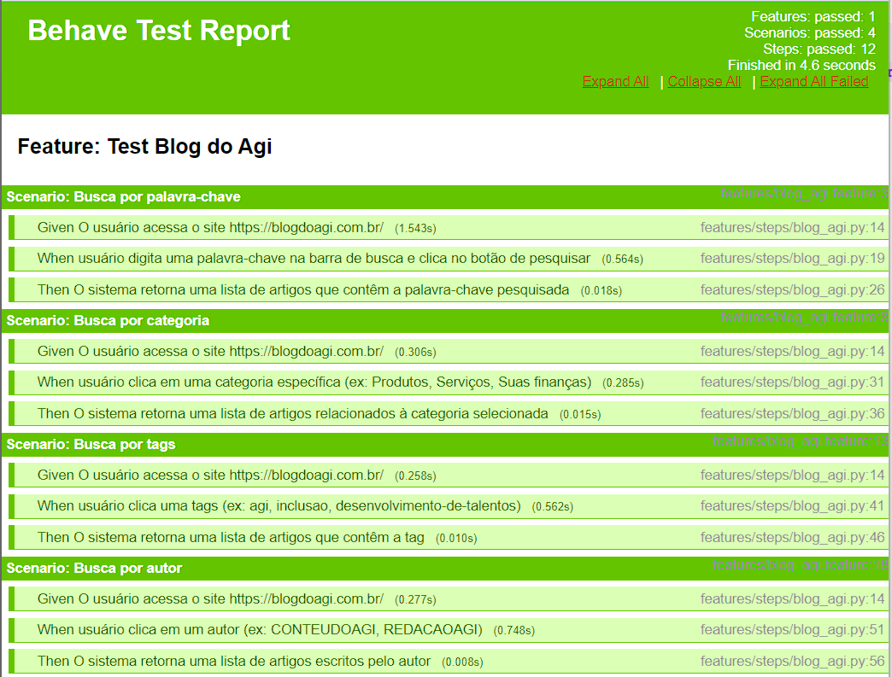

# Agi Bank

## Requirements

Pyhon 3.11

Behave

Selenium

### ChromeDriver

Visite o site para download do ChromeDriver

`https://sites.google.com/a/chromium.org/chromedriver/downloads`

Unzip chromedriver_win32.zip para pasta Script da instalação do Python

Examplo no Windows: `C:\Users\<Your_User>\AppData\Local\Programs\Python\Python311\Scripts`

### GeckoDriver

Visite o site para download do GeckoDriver

`https://github.com/mozilla/geckodriver/releases`

Unzip geckodriver-v0.33.0-win-aarch64.zip para pasta Script da instalação do Python

Examplo no Windows: `C:\Users\<Your_User>\AppData\Local\Programs\Python\Python311\Scripts`

## Install requirements
`pip install -r requirements.txt`

## Execute project

Entrar na pasta do projeto pelo terminal

`cd agibank`

Executar o teste

`behave -f html -o results/agi-report.html`

## Evidence of success

