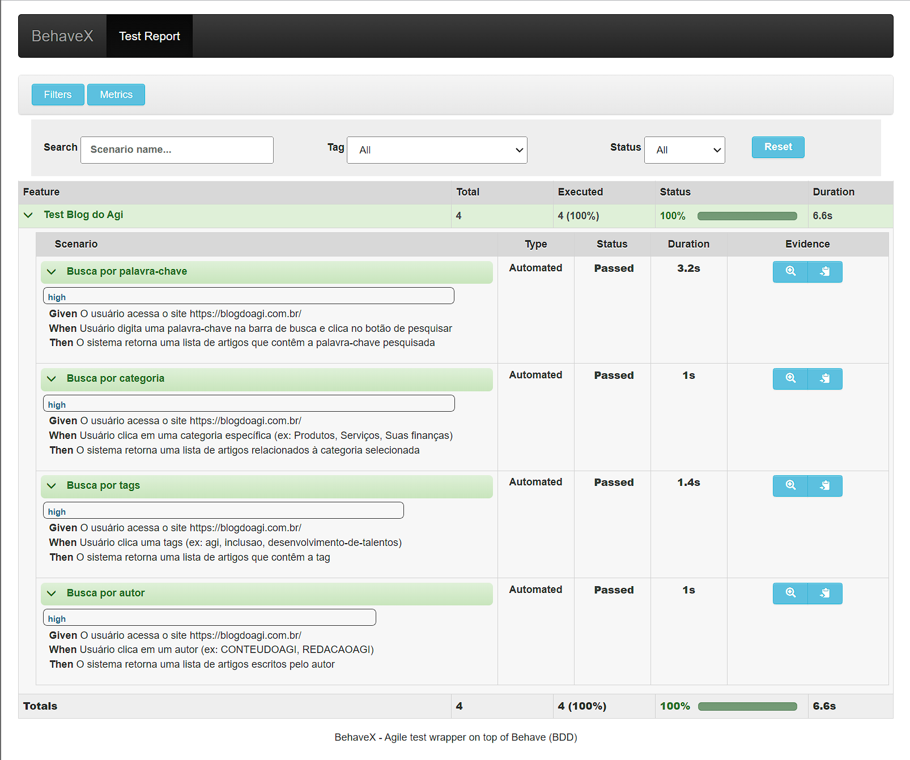

# Agi Bank

## Requirements

- Pyhon 3.11

- Behave

- Selenium

- Behavex

### ChromeDriver

Visite o site para download do ChromeDriver

`https://sites.google.com/a/chromium.org/chromedriver/downloads`

Unzip chromedriver_win32.zip para pasta Script da instalação do Python

Exemplo no Windows: `C:\Users\<Your_User>\AppData\Local\Programs\Python\Python311\Scripts`

### GeckoDriver

Visite o site para download do GeckoDriver

`https://github.com/mozilla/geckodriver/releases`

Unzip geckodriver-v0.33.0-win-aarch64.zip para pasta Script da instalação do Python

Exemplo no Windows: `C:\Users\<Your_User>\AppData\Local\Programs\Python\Python311\Scripts`

## Install requirements
`pip install -r requirements.txt`

## Executar o projeto

Entrar na pasta do projeto pelo terminal

`cd agibank`

Executar o teste usando Behavex

`behavex -t high`

## Evidencia de sucesso

## Report

- Não é possivel buscar por uma data, apenas se entrar pela URL exemplo: https://blogdoagi.com.br/2023/02/27/

- Não é possivel buscar por um autor, apenas se entrar pela URL exemplo: https://blogdoagi.com.br/author/conteudoagi/